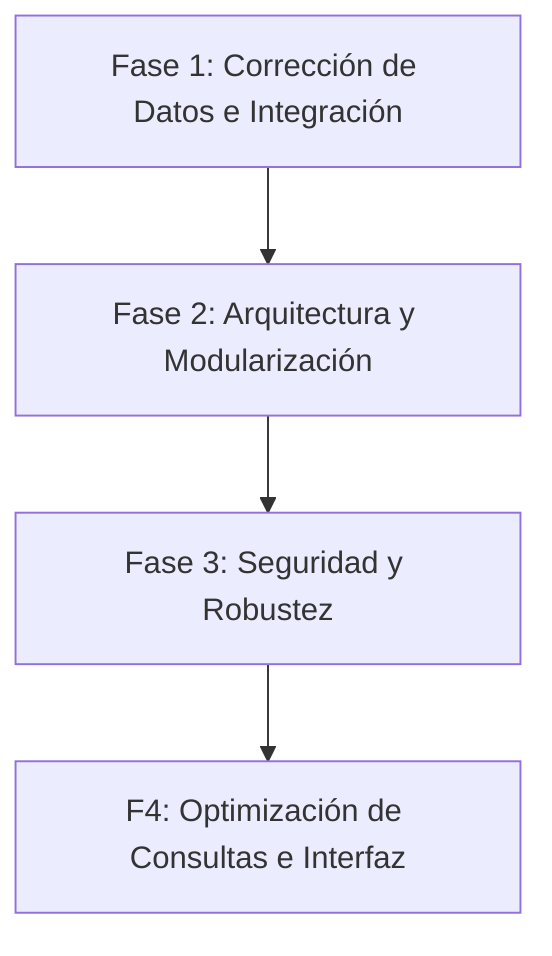

# Diagnóstico y Propuesta de Refactorización · SILOG SpA

Este documento presenta una auditoría técnica exhaustiva del estado actual de la plataforma web de **SILOG SpA**, detallando fallos críticos de integración, vulnerabilidades de seguridad, problemas de arquitectura, cuellos de botella de rendimiento y un plan de acción estratégico para elevar la aplicación a estándares profesionales de producción.

---

## 1. Hallazgos Críticos y Cuellos de Botella (Diagnóstico)

### A. Fallo de Integración en Cierre de Turno y Registro de Gastos (El "Bug del Combustible")
> [!CAUTION]
> **Error de consistencia grave detectado en el flujo de cierre de jornada.**
> Los gastos de combustible y peajes ingresados por el conductor durante su turno no se consolidan correctamente al cerrar la jornada, quedando en `$0` o con discrepancias numéricas significativas.

*   **Origen del problema (Inconsistencia de Colecciones):**
    En [gastos.html](file:///C:/Users/ASUS/.gemini/antigravity/scratch/silog-ops/gastos.html#L181-L186), los gastos en ruta se registran en la colección de Firestore `gastos_ruta`, utilizando el campo `monto_clp`:
    ```javascript
    await db.collection('gastos_ruta').add({
      turno_id: _turnoId,
      tipo: tipo,
      monto_clp: monto, // Campo correcto en CLP
      ...
    });
    ```
    Sin embargo, en [turno.html](file:///C:/Users/ASUS/.gemini/antigravity/scratch/silog-ops/turno.html#L400-L401), la función `cerrarTurno` intenta compilar estos datos consultando la colección incorrecta `gastos` y utilizando el campo inexistente `gd.monto`:
    ```javascript
    const gSnap = await db.collection('gastos').where('turno_id','==',_turnoDocId).get(); // ERROR: Debería ser 'gastos_ruta'
    gSnap.forEach(g => {
      const gd = g.data();
      if (gd.tipo === 'combustible') combustible += gd.monto || 0; // ERROR: Debería ser gd.monto_clp
      else if (gd.tipo === 'peaje') peaje += gd.monto || 0;
    });
    ```
    Esto hace que la hoja de ruta consolidada en la colección `hojas_ruta` guarde valores vacíos o nulos para combustible y peajes, rompiendo la trazabilidad en el panel de Finanzas.

*   **Redundancia Arquitectónica en Módulos de Viajes:**
    Existe una duplicación de flujos. El archivo [viajes.html](file:///C:/Users/ASUS/.gemini/antigravity/scratch/silog-ops/viajes.html) maneja un flujo de "Nuevo Viaje" y "Mis Viajes" que escribe en la colección `viajes`, mientras que [turno.html](file:///C:/Users/ASUS/.gemini/antigravity/scratch/silog-ops/turno.html) maneja "Apertura" y "Cierre" de turno y escribe en `turnos` y `hojas_ruta`. Esta desconexión confunde al usuario y provoca discrepancias de datos.

### B. Vulnerabilidades de Seguridad y Manejo de Estado
> [!WARNING]
> **La seguridad de la aplicación descansa casi por completo en el lado del cliente (Client-Side Security).**
> Un usuario con conocimientos mínimos de desarrollo web puede omitir los controles de acceso y manipular datos delicados.

*   **Bypass de Autorización (Role Check):**
    En [js/auth.js](file:///C:/Users/ASUS/.gemini/antigravity/scratch/silog-ops/js/auth.js#L159-L164), la función `requireAdmin` solo valida que el rol del usuario en la sesión sea administrador/administrativo:
    ```javascript
    function requireAdmin(callback) {
      requireAuth((user, data) => {
        if (!isViewerRole(data.role)) { window.location.href = '/dashboard.html'; return; }
        if (callback) callback(user, data);
      });
    }
    ```
    Como no se validan tokens criptográficos firmados (como Custom Claims de Firebase Auth) y las reglas de seguridad de Firestore (`firestore.rules`) no restringen estrictamente las colecciones basadas en roles robustos, un conductor podría falsificar su rol localmente (modificando el `sessionStorage` o interceptando las peticiones) para acceder a [finanzas.html](file:///C:/Users/ASUS/.gemini/antigravity/scratch/silog-ops/finanzas.html) o [admin.html](file:///C:/Users/ASUS/.gemini/antigravity/scratch/silog-ops/admin.html).

*   **Riesgo de Inyección XSS:**
    Aunque existe un sanitizador centralizado, páginas como [viajes.html](file:///C:/Users/ASUS/.gemini/antigravity/scratch/silog-ops/viajes.html#L239) y [finanzas.html](file:///C:/Users/ASUS/.gemini/antigravity/scratch/silog-ops/finanzas.html#L603) renderizan variables en el DOM usando plantillas HTML inyectadas mediante `innerHTML` sin escapar de forma consistente todas las entradas del usuario, lo que abre la puerta a ejecuciones de scripts maliciosos.

### C. Rendimiento y Escalabilidad (Firestore Reads & Renderizado)
> [!IMPORTANT]
> **Uso ineficiente de Firestore que impactará los costos y el rendimiento a mediano plazo.**

*   **Peticiones Masivas sin Límites ni Paginación:**
    En [finanzas.html](file:///C:/Users/ASUS/.gemini/antigravity/scratch/silog-ops/finanzas.html#L431-L454), la carga del "Centro de Costos" descarga **todos** los turnos, despachos y gastos de la base de datos sin límites de documentos (`.limit()`) ni paginación, realizando el filtrado por periodo, conductor y vehículo en memoria del cliente. A medida que la operación crezca, esta consulta causará miles de lecturas innecesarias en Firestore en cada carga de página.
*   **Ausencia de Operaciones Atómicas (Transactions & Batches):**
    En [turno.html](file:///C:/Users/ASUS/.gemini/antigravity/scratch/silog-ops/turno.html#L351-L352), al iniciar un turno se escribe el turno en la colección `turnos` y luego se actualiza el vehículo. Si la segunda operación falla, el turno queda abierto pero el vehículo no cambia de estado. Lo mismo ocurre en el cierre de turno. Deberían utilizarse `db.runTransaction` o `writeBatch` para asegurar la atomicidad de las operaciones críticas.

### D. Experiencia de Usuario y Robustez
*   **Manejo de Errores Silencioso:**
    Muchas llamadas asíncronas capturan errores con `catch(e) { console.warn(e); }` sin informar adecuadamente al usuario final mediante alertas visuales claras o mecanismos de reintento.
*   **Código Duplicado en Inicialización:**
    Todos los archivos `.html` contienen su propio bloque de scripts de Firebase y validación de autenticación inline. Esto dificulta el mantenimiento e incrementa innecesariamente el peso del frontend.

---

## 2. Plan de Acción (Fases de Trabajo)

Para llevar a cabo la refactorización de manera ordenada y segura, dividiremos el trabajo en 4 fases secuenciales.



### Fase 1: Corrección de Integraciones Críticas (Backend & Datos)
*   **Meta:** Corregir el bug del combustible y las inconsistencias de datos de manera inmediata.
*   **Acciones:**
    1.  Refactorizar la función `cerrarTurno` en [turno.html](file:///C:/Users/ASUS/.gemini/antigravity/scratch/silog-ops/turno.html) para que lea de la colección correcta `gastos_ruta` utilizando el campo `monto_clp`.
    2.  Validar en [gastos.html](file:///C:/Users/ASUS/.gemini/antigravity/scratch/silog-ops/gastos.html) que los inputs numéricos (litros, monto) se parseen limpiamente y no acepten valores negativos o `NaN`.
    3.  Asegurar que las hojas de ruta en `hojas_ruta` almacenen correctamente los totales calculados de combustible y peaje.

### Fase 2: Robustez Arquitectónica (Operaciones Atómicas & Unificación)
*   **Meta:** Prevenir estados inconsistentes en la base de datos y unificar los flujos redundantes.
*   **Acciones:**
    1.  Implementar transacciones (`firebase.firestore().runTransaction`) en [turno.html](file:///C:/Users/ASUS/.gemini/antigravity/scratch/silog-ops/turno.html) al iniciar y cerrar jornadas para asegurar que el estado del vehículo y del turno cambien de manera simultánea e inquebrantable.
    2.  Unificar el módulo obsoleto de [viajes.html](file:///C:/Users/ASUS/.gemini/antigravity/scratch/silog-ops/viajes.html) con el flujo oficial de [turno.html](file:///C:/Users/ASUS/.gemini/antigravity/scratch/silog-ops/turno.html) o redirigir el menú del conductor para evitar la carga doble de información.

### Fase 3: Seguridad de Datos y Sanitización (XSS & Roles)
*   **Meta:** Proteger la integridad del sistema ante manipulaciones maliciosas.
*   **Acciones:**
    1.  Revisar y robustecer las inyecciones de código HTML en todas las vistas (`admin.html`, `finanzas.html`, `viajes.html`, `analytics.html`) asegurando que se utilice la función `sanitize()` de forma obligatoria en cualquier campo de texto libre proveniente de Firestore.
    2.  Proponer mejoras en las reglas de seguridad de Firestore (`firestore.rules`) para validar que las lecturas a `hojas_ruta` o `prefacturas` solo puedan ser realizadas por usuarios cuyo rol en la colección de `users` sea admin o administrativo.

### Fase 4: Optimización de Rendimiento y Escalabilidad (Paginación & UX)
*   **Meta:** Reducir lecturas de base de datos y acelerar la carga de la aplicación.
*   **Acciones:**
    1.  Refactorizar el Centro de Costos en [finanzas.html](file:///C:/Users/ASUS/.gemini/antigravity/scratch/silog-ops/finanzas.html) y las gráficas en [analytics.html](file:///C:/Users/ASUS/.gemini/antigravity/scratch/silog-ops/analytics.html) agregando filtros de fecha nativos en la consulta de Firestore (`.where('fecha', '>=', startOfPeriod)`) en lugar de descargar toda la colección y filtrar en memoria.
    2.  Establecer un límite de 50 documentos con paginación infinita en las tablas de historial del conductor para evitar el sobrecalentamiento del dispositivo móvil.
    3.  Añadir un componente global visual de manejo de errores y fallos de conexión en `js/auth.js`.

---

## 3. Plan de Verificación y Pruebas

Para garantizar que ningún cambio rompa la experiencia del usuario o el correcto funcionamiento de la base de datos Firebase:

1.  **Validación de Compilación y Sintaxis:**
    *   Ejecutar análisis estático básico y simulación local del servidor web para descartar errores sintácticos en JavaScript.
2.  **Pruebas de Flujo Operativo Completo (Manual & Visual):**
    *   **Paso A (Apertura):** Conductor inicia turno -> Verificar cambio de estado del vehículo a "En Ruta" y validación del KM.
    *   **Paso B (En Ruta):** Registrar un gasto de $60.000 de combustible y $5.000 en peaje -> Verificar registro exacto de enteros y decimales en `gastos_ruta`.
    *   **Paso C (Cierre):** Finalizar turno ingresando KM final -> Verificar que la hoja de ruta consolidada contenga exactamente los $60.000 y $5.000 asociados.
    *   **Paso D (Finanzas):** Ingresar como Administrativo -> Verificar visualización en tabla del Centro de Costos y descarga del Excel con el título combinado y los montos correctos.
